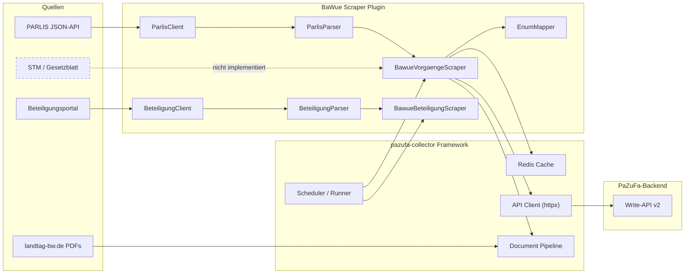
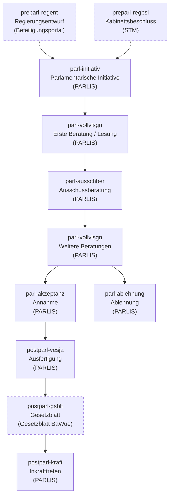

# BaWue Scraper

Collector for the Baden-Württemberg state parliament ([Landtag BW](https://www.landtag-bw.de/)) as part of
the [Parlamentszusammenfasser](https://codeberg.org/PaZuFa/parlamentszusammenfasser) (PaZuFa) platform. Scrapes
legislative proceedings (Vorgänge) from the PARLIS system and parliamentary sessions (Sitzungen) from the ICS calendar
feed, delivering them to the PaZuFa backend via the
[pazufa-collector](https://codeberg.org/PaZuFa/pazufa-collector) framework. Runs as a **framework-managed scraper** —
the collector framework handles scheduling, caching (Redis), API submission, and error tolerance automatically.

## Anforderungen

Der Landtag Baden-Württemberg veröffentlicht parlamentarische Vorgänge ausschließlich über das geschlossene
PARLIS-System — ohne offizielle API und ohne Open-Data-Schnittstelle. Dieser Scraper überbrückt diese Lücke, indem er
strukturierte Daten aus PARLIS extrahiert und sie über das pazufa-collector Framework an das PaZuFa-Backend liefert.
Ziel ist eine vollständige, maschinenlesbare Abbildung aller Gesetzgebungsvorgänge des Landtags.

### Dokumentenpriorisierung

| Priorität  | Daten                                | Quelle                     |
|------------|--------------------------------------|----------------------------|
| **Primär** | Vorgänge + Stationen + Dokumentlinks | PARLIS JSON-API            |
| **Primär** | Drucksachen-Volltext (PDFs)          | landtag-bw.de              |
| **Primär** | Sitzungstermine (Plenar/Ausschuss)   | ICS-Kalender landtag-bw.de |
| Ergänzend  | Vorparlamentarische Entwürfe         | Beteiligungsportal BaWue   |
| Optional   | Kabinettsbeschlüsse, Gesetzblatt     | STM / Gesetzblatt BaWue    |

### Identifikation

| Identifikator         | Format    | Beispiel       | Quelle                                                      |
|-----------------------|-----------|----------------|-------------------------------------------------------------|
| Vorgangsnummer        | `V-XXXXX` | `V-42771`      | PARLIS HTML / JS                                            |
| Drucksachennummer     | `WP/NR`   | `17/10266`     | Fundstellen-Regex                                           |
| Plenarprotokollnummer | `WP/NR`   | `17/141`       | Fundstellen-Regex                                           |
| API-ID                | UUID v5   | `550e8400-...` | Vom Scraper generiert (`uuid5(NAMESPACE_URL, vorgangs_id)`) |

### Gesammelte Informationen

Übersicht der Felder pro Datenmodell — was aktuell befüllt wird und was noch fehlt:

- **Vorgang**: `titel`, `typ`, `initiatoren`, `stationen`, `wahlperiode`, `ids`, `api_id`
  — fehlt: `kurztitel`, `links`, `lobbyregister`
- **Station**: `typ`, `zp_start`, `gremium`, `dokumente`
  — fehlt: `schlagworte`, `stellungnahmen`, `trojanergefahr`
- **Dokument**: `link`, `drucksnr`, `typ`, `zp_modifiziert`, `zp_referenz`, `autoren`
  — fehlt: `volltext`, `hash`, `zusammenfassung` (vom Framework-Dokumentpipeline zu befüllen)

### Datenfluss

**Informationsquellen und Scraper-Komponenten:**



Gestrichelte Linien (- - -) kennzeichnen noch nicht aktive Pfade.

**Lebenszyklus eines Vorgangs (Stationstypen):**



### Umsetzungsstand

#### Vollständigkeit (Stand: März 2026)

| Kategorie                    | Schätzung | Anmerkungen                                                                |
|------------------------------|-----------|----------------------------------------------------------------------------|
| **Pflichtfunktionalität**    | **~80 %** | Kernfelder vollständig; `tops=[]` und `nummer=0` für Ausschüsse fehlen     |
| **Optionale Funktionalität** | **~22 %** | Primär-IDs und Basisdaten vorhanden; Metadaten & Zusatzquellen fehlen      |

**Pflichtfunktionalität – Lücken:**
- `tops` in `Sitzung` immer `[]` (Phase 2, Tagesordnungen-PDFs nicht geparst)
- `nummer` in `Sitzung` für Ausschusssitzungen fest `0` (kein Regex-Match im ICS-Feed)
- `verfassungsaendernd` immer `False` (PARLIS gibt dieses Merkmal nicht aus)

**Optionale Funktionalität – Lücken:**
- Fehlende Felder: `kurztitel` (Vorgang/Dokument), `links` (Vorgang), `lobbyregister`, `schlagworte` (Station/Dokument), `stellungnahmen`, `trojanergefahr`, `vorwort`, `zp_modifiziert` (Station), `gremium_federf`
- Fehlende Datenquellen: Gesetzblatt BaWue (`postparl-gsblt`), Kabinettsbeschlüsse STM

**Feldstatus-Matrix (Pflichtfelder):**

| Modell   | Feld                  | Status       | Anmerkung                                    |
|----------|-----------------------|--------------|----------------------------------------------|
| Vorgang  | `api_id`              | ✅ Voll       | `uuid5(NAMESPACE_URL, vorgangs_id)`          |
| Vorgang  | `titel`               | ✅ Voll       | Aus PARLIS / Beteiligungsportal              |
| Vorgang  | `typ`                 | ✅ Voll       | Enum-gemappt                                 |
| Vorgang  | `wahlperiode`         | ✅ Voll       | Fest WP 17                                   |
| Vorgang  | `verfassungsaendernd` | ⚠️ Partiell  | Immer `False` (PARLIS gibt nichts her)       |
| Vorgang  | `initiatoren`         | ✅ Voll       | Aus Initiative-Feld                          |
| Vorgang  | `stationen`           | ✅ Voll       | Aus Fundstellen-Parsing                      |
| Station  | `typ`                 | ✅ Voll       | Kontextbewusstes Enum-Mapping                |
| Station  | `dokumente`           | ✅ Voll       | PDF-Links aus Fundstelle                     |
| Station  | `zp_start`            | ✅ Voll       | Aus Fundstelle-Datum (mit Fallbacks)         |
| Station  | `gremium`             | ✅ Voll       | Aus Ausschuss / Plenarprotokoll              |
| Dokument | `titel`               | ✅ Voll       | Stationstyp als Fallback                     |
| Dokument | `volltext`            | ⚠️ Framework | Framework-Pipeline (PyPDF + OCR + LLM)       |
| Dokument | `hash`                | ⚠️ Framework | Framework berechnet                          |
| Dokument | `typ`                 | ✅ Voll       | Enum-gemappt                                 |
| Dokument | `zp_modifiziert`      | ✅ Voll       | Fundstelle-Datum                             |
| Dokument | `zp_referenz`         | ✅ Voll       | Fundstelle-Datum                             |
| Dokument | `link`                | ✅ Voll       | PDF-URL aus Fundstelle                       |
| Dokument | `autoren`             | ✅ Voll       | Aus Fundstelle-Text, Fallback auf Initiative |
| Sitzung  | `termin`              | ✅ Voll       | ICS DTSTART (Berlin TZ → UTC)                |
| Sitzung  | `gremium`             | ✅ Voll       | Aus ICS SUMMARY                              |
| Sitzung  | `nummer`              | ⚠️ Partiell  | Regex für Plenum; Ausschüsse = `0`           |
| Sitzung  | `tops`                | ❌ Fehlt      | Immer `[]` (Phase 2: Tagesordnungen-PDFs)    |
| Sitzung  | `public`              | ✅ Voll       | Immer `True`                                 |

#### Feature-Status

| Feature                    | Status              | Anmerkungen                                                                  |
|----------------------------|---------------------|------------------------------------------------------------------------------|
| PARLIS-Suche (Vorgänge)    | Funktioniert        | Automatische Unterteilung bei zu großen Ergebnismengen                       |
| Vorgang-Extraktion         | Funktioniert        | Titel, Typ, Initiative, Vorgangs-ID                                          |
| Station-Extraktion         | Funktioniert        | Aus Fundstellen-Parsing (Datum, Typ, Gremium, Dokumentlinks)                 |
| Enum-Mapping               | Funktioniert        | PARLIS-Begriffe → PaZuFa-Enumerationen (Vorgangs-/Stations-/Dokumententyp)   |
| Caching                    | Framework (Redis)   | Automatische Deduplizierung über pazufa-collector ScraperCache               |
| API-Einlieferung           | Framework           | Automatisch via pazufa-collector API-Client (httpx)                          |
| Fehlertoleranz             | Framework           | Einzelne Vorgang-Fehler stoppen die Pipeline nicht                           |
| Scheduling                 | Framework           | Konfigurierbar über `cycle-time-s` in config.toml                            |
| PDF-Volltext-Extraktion    | Framework-Pipeline  | PyPDF + Kreuzberg/EasyOCR + LLM (via pazufa-collector)                       |
| Dokumenten-Autoren         | Funktioniert        | Aus Fundstelle-Text extrahiert, Fallback auf Initiative                      |
| Beteiligungsportal         | Funktioniert        | Vorparlamentarische Entwürfe aus Beteiligungsportal (preparl-regent Station) |
| Sitzungskalender (Phase 1) | Funktioniert        | ICS-Feed-Parsing, Sitzung-Modelle mit `nummer=0`, `tops=[]`                  |
| Detail-Seiten (PARLIS)     | Nicht implementiert | Zusätzliche Metadaten über PARLIS-Detailseiten                               |
| Kabinettsbeschlüsse (STM)  | Nicht implementiert | Signalquelle für neue Regierungsentwürfe                                     |
| Gesetzblatt-Verkündungen   | Nicht implementiert | Postparlamentarische Phase (`postparl-gsblt` Station)                        |
| Sitzungskalender (Phase 2) | Nicht implementiert | Anreicherung mit Tagesordnungen-PDFs für Sitzungsnummern und TOPs            |

### Next Steps

| # | Feature                             | Priorität     | Beschreibung                                                                                                                                                                            |
|---|-------------------------------------|---------------|-----------------------------------------------------------------------------------------------------------------------------------------------------------------------------------------|
| 1 | ~~SitzungsScraper (ICS-Kalender)~~  | ~~Hoch~~      | ~~Phase 1 implementiert~~ — `BawueSitzungenScraper` parst ICS-Feed, erzeugt `Sitzung`-Modelle mit `nummer=0`, `tops=[]`.                                                                |
| 2 | SitzungsScraper Phase 2 (TOPs)      | Hoch          | Anreicherung: Tagesordnungen-PDFs von landtag-bw.de scrapen, Sitzungsnummern aus Dateinamen extrahieren, TOPs aus PDFs parsen.                                                          |
| 3 | ~~Beteiligungsportal (vorparlam.)~~ | ~~Ergänzend~~ | ~~HTML-Scraping des Beteiligungsportals BaWue für vorparlamentarische Entwürfe und Stellungnahmen.~~ `BawueBeteiligungScraper` implementiert — preparl-regent Station mit Entwurf PDFs. |
| 4 | Gesetzblatt BaWue (postparlam.)     | Ergänzend     | Verkündungen im Gesetzblatt erfassen (`postparl-gsblt`). Komplettiert den Gesetzgebungslebenszyklus nach der parlamentarischen Phase.                                                   |

---

## Prerequisites

- Python 3.14+
- [pazufa-collector](https://codeberg.org/PaZuFa/pazufa-collector) (framework dependency, cloned alongside)
- Redis (required at runtime; the framework connects on startup and exits if unavailable — use `docker-compose up -d` for local dev)
- Tesseract OCR with German language pack (for PDF extraction via framework pipeline)

## Setup

```bash
# Clone the project and the framework
git clone <repo-url> pazufa-bawue-scraper
git clone https://codeberg.org/PaZuFa/pazufa-collector.git

# Enter the project and create virtual environment
cd pazufa-bawue-scraper
python3 -m venv .venv

# Install all dependencies
make install

# Configure
# Edit config.sample.toml with your API credentials and settings
```

## Usage

The scraper is run via the pazufa-collector framework runner:

```bash
make run

# Or with a custom config file:
.venv/bin/python -m collector --config-file config.sample.toml

# The framework automatically:
# - Discovers BawueVorgaengeScraper, BawueBeteiligungScraper and BawueSitzungenScraper in src/bawue/
# - Runs listing_page_extractor for each Vorgangstyp / ICS feed URL
# - Runs item_extractor for each found Vorgang / date key
# - Caches results in Redis (if configured)
# - Submits Vorgänge and Sitzungen to the PaZuFa backend
# - Repeats after cycle-time-s seconds
```

### Dry-Run Report

Run the scraper pipeline without posting to the API to diagnose what gets scraped, parsed, and what's missing:

```bash
# Run all scrapers with default settings (7-day lookback)
.venv/bin/python -m bawue.dry_run

# Run only Vorgaenge for a specific type, limited to 3 items, with full detail
.venv/bin/python -m bawue.dry_run --scraper vorgaenge --vorgangstyp "Kleine Anfrage" --limit 3 --verbosity 2

# Run only Beteiligung scraper
.venv/bin/python -m bawue.dry_run --scraper beteiligung

# Run only Sitzungen scraper
.venv/bin/python -m bawue.dry_run --scraper sitzungen

# Output as JSON
.venv/bin/python -m bawue.dry_run --json --limit 5

# Custom lookback and wahlperiode
.venv/bin/python -m bawue.dry_run --lookback-days 30 --wahlperiode 17
```

**CLI options:**

| Option            | Default           | Description                                                   |
|-------------------|-------------------|---------------------------------------------------------------|
| `--scraper`       | `all`             | Which scraper: `vorgaenge`, `beteiligung`, `sitzungen`, `all` |
| `--vorgangstyp`   | *(all)*           | Limit to one PARLIS Vorgangstyp (e.g. `"Kleine Anfrage"`)     |
| `--lookback-days` | 7                 | Days to look back for PARLIS search                           |
| `--wahlperiode`   | 17                | Wahlperiode number                                            |
| `--limit`         | *(no limit)*      | Max items per scraper (useful for quick checks)               |
| `--verbosity`     | 0                 | Detail level: 0=summary, 1=type breakdown, 2=per-item detail  |
| `--json`          | off               | Output JSON instead of formatted text                         |
| `--ics-url`       | *(landtag-bw.de)* | Custom ICS calendar URL                                       |

No API keys, Redis, or backend connection required — the dry-run uses scraper components directly.

### Running against the Mock Backend

For end-to-end testing with a real scraper run (including actual API submission), a mock PaZuFa backend
is included. It accepts all collector write-API calls, prints every request in detail, and decodes
`X-API-Key` JWT tokens for inspection — no real backend required.

**0. Start Redis (required at startup):**

```bash
docker-compose up -d
```

**1. Start the mock server:**

```bash
.venv/bin/python mock_pazufa_server.py --port 8080
```

The server prints startup info and then logs every incoming request:

```
PaZuFa Mock Server
  Listening on http://127.0.0.1:8080
  Endpoints:
    PUT /api/v2/vorgang
    PUT /api/v2/kalender/{parlament}/{datum}
    GET /health
```

**2. Point the scraper at the mock server** — copy `config.sample.toml` to `config.toml` and set:

```toml
[backend]
ltzf-api-url = "http://127.0.0.1:8080"
ltzf-api-key  = "any-key-or-paste-a-real-jwt-here"
```

**3. Run the scraper:**

```bash
make run
```

Every `PUT /api/v2/vorgang` and `PUT /api/v2/kalender/BW/{date}` call will be logged to the mock
server's terminal with:

- Full headers and path parameters
- JWT decode of `X-API-Key` (header, payload claims, expiry check, `collector` scope check) — or plain
  key display if not a JWT
- Pretty-printed JSON body (first 60 lines)
- HTTP 201 response for all valid requests; 401 if `X-API-Key` is missing

**Mock server options:**

| Option   | Default     | Description       |
|----------|-------------|-------------------|
| `--port` | `8080`      | Port to listen on |
| `--host` | `127.0.0.1` | Interface to bind |

## Configuration

Configuration uses the pazufa-collector 4-tier system: Defaults → TOML (`config.toml`) → Environment variables → CLI.

### Framework configuration (config.toml)

| Section      | Key              | Description                                       |
|--------------|------------------|---------------------------------------------------|
| `[main]`     | `collector-uuid` | Unique collector instance ID                      |
| `[main]`     | `cycle-time-s`   | Seconds between scraping cycles (default: 10800)  |
| `[cache]`    | `redis-host`     | Redis host (optional)                             |
| `[cache]`    | `redis-port`     | Redis port (default: 6379)                        |
| `[backend]`  | `ltzf-api-url`   | PaZuFa backend base URL                           |
| `[backend]`  | `ltzf-api-key`   | API key with `collector` scope                    |
| `[scrapers]` | `scraper-dir`    | Directory containing scraper modules              |
| `[llm]`      | `openai-api-key` | API key for LLM document summarization (optional) |

### BaWue-specific configuration (config.toml `[bawue]` section)

| Key                      | Default                    | Description                                              |
|--------------------------|----------------------------|----------------------------------------------------------|
| `wahlperiode`            | 17                         | Current Wahlperiode                                      |
| `parlis-request-delay-s` | 1.0                        | Delay between PARLIS requests in seconds                 |
| `wahlperiode-start-date` | `"2021-04-26"`             | Start date of current Wahlperiode (sets search range)    |
| `ics-url`                | *(landtag-bw.de ICS feed)* | URL of the ICS calendar feed for Sitzungen               |

### Beteiligungsportal configuration (config.toml `[beteiligung]` section)

| Key                | Default | Description                                           |
|--------------------|---------|-------------------------------------------------------|
| `wahlperiode`      | 17      | Wahlperiode for LP index URL                          |
| `request-delay-s`  | 2.0     | Delay between Beteiligungsportal requests in seconds  |

## Development

A `Makefile` is provided so you don't need to activate the venv manually. Run `make help` to list all targets.

```bash
make install          # Install dependencies via Poetry
make test             # Unit tests (default, fast)
make test-cov         # Tests with coverage
make test-all         # All tests including integration
make test-integration # Integration tests only (requires backend)
make lint             # Lint
make lint-fix         # Lint with auto-fix
make format           # Format code
make run              # Run the scraper
make package          # Vendor collector + Docker build
make clean            # Remove .venv, __pycache__, .pytest_cache
```

### Docker

```bash
make package          # vendors collector + builds image
docker run bawue-scraper
```

The Docker image includes Tesseract OCR for PDF text extraction. Redis should be provided as a separate
service (e.g. via docker-compose).

## Project Structure

```
pazufa-bawue-scraper/
├── pyproject.toml                      # Poetry project, depends on pazufa-collector
├── config.toml                         # Framework + BaWue-specific configuration
├── Dockerfile                          # Python 3.12, Poetry, Tesseract OCR
├── src/
│   └── bawue/
│       ├── bawue_vorgaenge_scraper.py  # VorgangsScraper subclass (framework auto-discovery)
│       ├── bawue_beteiligung_scraper.py # VorgangsScraper for Beteiligungsportal (preparl-regent)
│       ├── bawue_sitzungen_scraper.py  # SitzungsScraper subclass (ICS calendar → Sitzung)
│       ├── beteiligung_client.py       # Beteiligungsportal HTTP client
│       ├── beteiligung_parser.py       # Beteiligungsportal HTML parsing (TYPO3)
│       ├── ics_parser.py               # Stateless ICS parsing + event filtering
│       ├── parlis_client.py            # PARLIS HTTP logic (session, search, pagination)
│       ├── parlis_parser.py            # HTML parsing + fundstelle regex parsing
│       ├── enum_mapper.py              # PARLIS → PaZuFa enum mapping
│       ├── rate_limiter.py             # Adaptive rate limiting (AIMD-inspired)
│       ├── types.py                    # RawVorgang, RawFundstelle TypedDicts
│       ├── report.py                   # Dry-run analysis dataclasses + formatting
│       └── dry_run.py                  # Dry-run CLI entry point (python -m bawue.dry_run)
├── tests/
│   └── unit/
│       ├── fixtures/
│       │   ├── beteiligung/            # Beteiligungsportal HTML fixtures (index + detail pages)
│       │   └── sample_calendar.ics     # ICS fixture for deterministic tests
│       ├── test_bawue_scraper.py       # _build_vorgang / _build_station tests
│       ├── test_bawue_sitzungen_scraper.py # SitzungsScraper tests
│       ├── test_ics_parser.py          # ICS parsing / filtering / grouping tests
│       ├── test_parlis_client.py       # PARLIS HTTP client tests
│       ├── test_parlis_parser.py       # HTML / fundstelle parsing tests
│       ├── test_enum_mapper.py         # Enum mapping + framework validation tests
│       ├── test_report.py             # Dry-run analysis + formatting tests
│       └── test_dry_run.py            # Dry-run CLI + orchestration tests
└── docs/
    ├── architecture.md                 # System overview, data flow, components
    └── anforderungen.md                # Datenmodelle, API, Enumerationen, Datenquellen
```

## Architecture

The scraper is a **plugin** for the pazufa-collector framework. It implements the `VorgangsScraper` and
`SitzungsScraper` base classes, which the framework auto-discovers and orchestrates. The framework handles scheduling,
Redis caching, API submission, document processing (PDF extraction + LLM summarization), and error tolerance. The BaWue
scraper contains PARLIS-specific logic (HTTP communication, HTML parsing, fundstelle regex extraction, enum mapping) and
ICS calendar parsing for session data.

See [docs/architecture.md](docs/architecture.md) for the full architecture documentation.

**Data sources:**

- **PARLIS** — undocumented JSON/HTML API at `parlis.landtag-bw.de` (primary source for Vorgänge)
- **ICS Calendar** — `landtag-bw.de` calendar feed (primary source for Sitzungen)

**Framework-provided capabilities:**

- Redis-based caching with 2-week TTL (replaces file-based cache)
- Auto-generated httpx API client (replaces hand-written LtzfClient)
- Auto-generated OpenAPI models (replaces hand-written Pydantic models)
- Document pipeline: PyPDF + Kreuzberg/EasyOCR + LLM (replaces pdfplumber/pytesseract)
- Scheduling, error tolerance, and scraper lifecycle management

## Links

### PaZuFa / Parlamentszusammenfasser (Codeberg)

- [PaZuFa Organization](https://codeberg.org/PaZuFa)
- [parlamentszusammenfasser](https://codeberg.org/PaZuFa/parlamentszusammenfasser) — Main project
- [pazufa-collector](https://codeberg.org/PaZuFa/pazufa-collector) — Collector framework (dependency)
- [pazufa-backend](https://codeberg.org/PaZuFa/pazufa-backend) — Backend service

### General

- [Bundestagszusammenfasser](https://bundestagszusammenfasser.de/)
- [Landtag BaWue](https://www.landtag-bw.de/)

### PaZuFa Documentation

- [PaZuFa Docs (Nextcloud)](https://wolke7.pazufa.de)
- [PaZuFa Wiki](https://wiki.pazufa.de/)
- [Parlamentszusammenfasser docs](https://codeberg.org/PaZuFa/parlamentszusammenfasser/src/branch/main/docs/README.md)
- [OpenAPI-Spezifikation](https://codeberg.org/PaZuFa/parlamentszusammenfasser/src/branch/main/docs/specs/openapi.yml)
- [Authentication](https://codeberg.org/PaZuFa/parlamentszusammenfasser/src/branch/main/docs/authentication.md)

### Project Documentation

- [Anforderungen](docs/anforderungen.md) — Datenmodelle, API-Endpunkte, Enumerationen, Datenquellen
- [Architecture](docs/architecture.md) — System overview, framework integration, data flow, enum mapping
