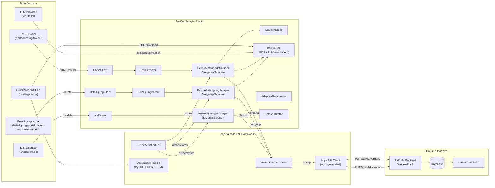
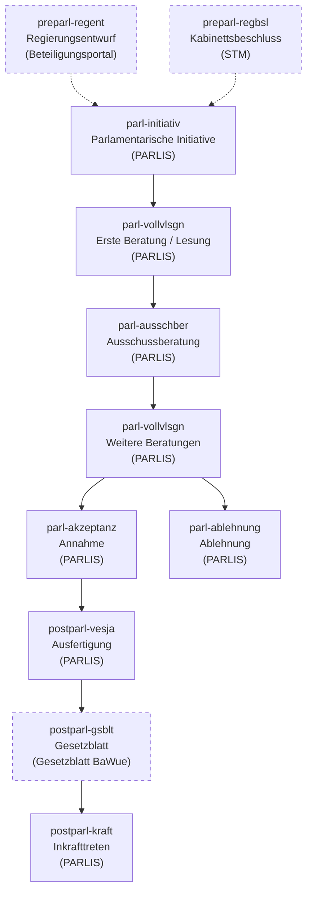
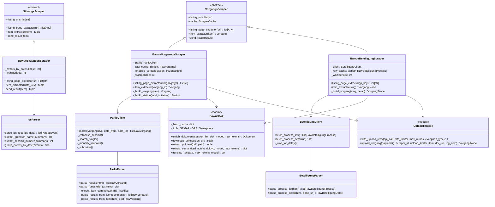
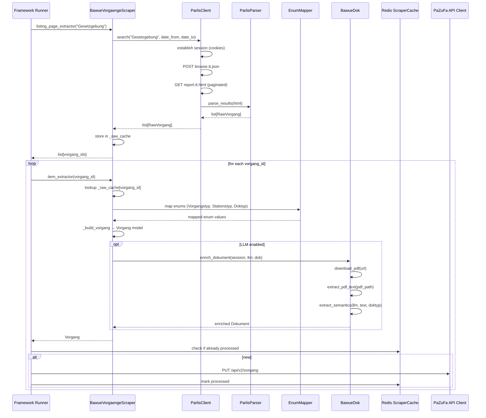

# Architecture: BaWue Scraper

## 1. System Overview

The BaWue Scraper is a **scraper plugin** for the
[pazufa-collector](https://codeberg.org/PaZuFa/pazufa-collector) framework. It implements `VorgangsScraper` and
`SitzungsScraper` base classes, which the framework auto-discovers and orchestrates. The framework handles all
cross-cutting concerns — scheduling, Redis caching, API submission, document processing, and error tolerance.

Three data sources are covered:

1. **PARLIS** — parliamentary proceedings (Vorgänge) via HTML scraping
2. **Beteiligungsportal Baden-Württemberg** — pre-parliamentary draft laws (`preparl-regent` station)
3. **ICS calendar** — parliamentary sessions (Sitzungen)



### Legislative Lifecycle (Stationstypen)



Dashed lines mark stages not yet implemented. See [status.md](status.md) for implementation details.

**Key characteristics:**
- Parliament code: `BW`, Wahlperiode: 17
- Authentication: `X-API-Key` header with `collector` scope (framework-managed)
- Caching: Redis ScraperCache with 2-week TTL (framework-managed)
- Models: Auto-generated from OpenAPI specification — no hand-written models
- The PaZuFa backend handles deduplication/merging — the scraper does not need to

## 2. Dependencies

| Dependency       | Purpose                                                 | Owned by      |
|------------------|---------------------------------------------------------|---------------|
| `requests`       | PARLIS + Beteiligungsportal HTTP sessions (synchronous) | BaWue scraper |
| `lxml`           | HTML parsing of PARLIS and Beteiligungsportal pages     | BaWue scraper |
| `icalendar`      | ICS calendar feed parsing for Sitzungen                 | BaWue scraper |
| `aiohttp`        | Async HTTP sessions for framework                       | Framework     |
| `httpx`          | Auto-generated PaZuFa API client                        | Framework     |
| `openapi-client` | Auto-generated Pydantic models from OpenAPI spec        | Framework     |
| `kreuzberg`      | PDF text extraction (normal + OCR fallback)              | BaWue scraper |
| `redis`          | Caching of processed Vorgänge/Dokumente                 | Framework     |
| `litellm`        | LLM integration: token counting/truncation + framework pipeline | Framework + BaWue scraper |
| `collector-core` | LLMConnector base class for LLM calls                   | Framework (used by BaWue scraper) |

## 3. Framework Integration



### Scraper Contract

All three scrapers follow the same two-phase pattern:

1. `listing_page_extractor(key)` — fetches the source and returns item identifiers; stores raw data in `_raw_cache`
2. `item_extractor(id)` — looks up `_raw_cache`, builds and returns the framework model

| Scraper                    | `listing_urls` values        | `listing_page_extractor` returns | `item_extractor` returns       | `send_result` override |
|----------------------------|------------------------------|----------------------------------|--------------------------------|------------------------|
| `BawueVorgaengeScraper`    | enabled Vorgangstyp strings (3 by default, configurable) | vorgang IDs | `Vorgang`             | No                     |
| `BawueBeteiligungScraper`  | LP index keys (`lp-17`)      | process slugs                    | `Vorgang\|None`                | No                     |
| `BawueSitzungenScraper`    | ICS feed URL                 | ISO date strings                 | `(datetime, List[Sitzung])`    | Yes — use `Parlament.BW` |

**PARLIS listing URL pattern:** PARLIS has no traditional listing URLs. `listing_urls` contains the enabled Vorgangstyp
strings. By default these are the 3 types with full PaZuFa model support: `"Gesetzgebung"`, `"Haushaltsgesetzgebung"`,
and `"Volksantrag"` (configurable via `enabled-vorgangstypen` in `config.toml`). The framework calls
`listing_page_extractor()` for each one, which searches PARLIS, stores raw results in `_raw_cache`, and returns vorgang
IDs. Items whose `Vorgangstyp` field doesn't match the enabled set are dropped defensively even if PARLIS returns them.

### Framework-Provided Capabilities

| Capability          | What the framework does                                  |
|---------------------|----------------------------------------------------------|
| Scheduling          | Repeats scraping cycles at configurable intervals        |
| Redis caching       | 2-week TTL, multi-level (vorgang, dokument, HTML)        |
| API client          | Auto-generated httpx client with retry logic             |
| Models              | Auto-generated Pydantic models from OpenAPI spec         |
| Document processing | PyPDF + Kreuzberg/EasyOCR + LLM pipeline                 |
| Error tolerance     | Per-item error handling, doesn't stop on single failures |
| Config              | 4-tier: Defaults → TOML → env vars → CLI                 |

## 4. Data Flow



## 5. Components

### BawueVorgaengeScraper

Subclass of `VorgangsScraper`. Searches PARLIS by Vorgangstyp, converts raw HTML data into framework `Vorgang` models.
Uses `_raw_cache` to bridge the listing/item phases. Configuration from `[bawue]` section.

Only the Vorgangstypen listed under `enabled-vorgangstypen` in `config.toml` are scraped (default: `Gesetzgebung`,
`Haushaltsgesetzgebung`, `Volksantrag`). These are the only types with full PaZuFa model support. Results with any
other type are dropped defensively in `listing_page_extractor`, even if PARLIS returns them unexpectedly.

### BawueSitzungenScraper

Subclass of `SitzungsScraper`. Fetches ICS calendar, parses and filters events, builds `Sitzung` models.
Overrides `send_result()` to use `Parlament.BW`. Uses `_events_by_date` to bridge listing/item phases.

**Field mapping:**

| Sitzung field | Source  | Notes                                                |
|---------------|---------|------------------------------------------------------|
| `termin`      | DTSTART | Naive → Europe/Berlin → UTC                          |
| `gremium`     | SUMMARY | Parsed via `extract_gremium_name()`                  |
| `nummer`      | SUMMARY | `extract_session_number()` regex; `0` for committees |
| `tops`        | —       | `[]` (not available in ICS feed)                     |
| `public`      | —       | `True`                                               |
| `api_id`      | UID     | `uuid5(NAMESPACE_URL, uid)` for determinism          |

### BawueBeteiligungScraper

Subclass of `VorgangsScraper`. Fetches the [Beteiligungsportal BW](https://beteiligungsportal.baden-wuerttemberg.de)
LP index, filters to legislative content (pages with Entwurf PDFs), builds `Vorgang` with `preparl-regent` station.
Configuration from `[beteiligung]` section.

**Vorgang / Station mapping:**

| Field            | Value                                                 |
|------------------|-------------------------------------------------------|
| `api_id`         | `uuid5(NAMESPACE_URL, "beteiligung-{slug}")`          |
| `titel`          | Detail page heading (dossier-header h1)               |
| `kurztitel`      | URL slug (for backend merging with PARLIS data)       |
| `typ`            | `Vorgangstyp.GG_MINUS_LAND_MINUS_PARL`               |
| `initiatoren`    | `[Autor(organisation=ministry)]`                      |
| Station `typ`    | `Stationstyp.PREPARL_MINUS_REGENT`                    |
| Station `gremium`| `Parlament.BW, "Landesregierung"`                     |
| Station `dokumente` | Each PDF → `Doktyp.PREPARL_MINUS_ENTWURF`          |
| Station `zp_start` | Comment deadline date                               |

### BeteiligungClient / BeteiligungParser

`BeteiligungClient` encapsulates HTTP communication with the Beteiligungsportal (synchronous `requests.Session`,
configurable delay, User-Agent `PaZuFa-BaWue-Scraper/0.1`).

`BeteiligungParser` is stateless lxml/XPath parsing: process cards from LP index (`article.teaser`), title/ministry/
PDF links/deadline from detail pages. Data classes: `RawBeteiligungProcess`, `RawBeteiligungDetail`.

### IcsParser

Stateless ICS parsing via the `icalendar` library. Filters events by SUMMARY prefix:

| SUMMARY prefix                                   | Included? | Gremium name           |
|--------------------------------------------------|-----------|------------------------|
| `Plenarsitzung:`                                 | Yes       | `"Plenum"`             |
| `Fraktions- und Ausschusssitzungen: Ausschuesse` | Yes       | `"Ausschusssitzungen"` |
| `Fraktions- und Ausschusssitzungen: FinA`        | Yes       | `"Finanzausschuss"`    |
| `Haushaltsberatungen: ...`                       | Yes       | extract after `: `     |
| `Fraktions- und Ausschusssitzungen: Fraktionen`  | No        | faction-only           |
| `Prasidium:`                                     | No        | internal               |
| `Wahl:`                                          | No        | election event         |

### ParlisClient / ParlisParser

`ParlisClient` manages sessions, constructs search queries, executes `POST browse.tt.json`, and fetches paginated
results via `GET report.tt.html`. Handles automatic date subdivision for large result sets.

`ParlisParser` extracts Vorgang data from PARLIS HTML responses. The primary path parses structured JSON objects
embedded in HTML comments (`<!--{...}-->`) using stable field codes (`EWBV10` for title, `WMV35` for Fundstellen,
etc.). If no JSON comments are found, it falls back to HTML/XPath parsing with regex-based Fundstellen extraction
(DD-014). Fundstelle text parsing (dates, Drucksache/Plenarprotokoll numbers, committee names, authors) is shared
by both paths.

### EnumMapper

Maps PARLIS terminology to PaZuFa enum values. Context-aware for Stationstyp (e.g. Gesetzentwurf from Landesregierung
→ `preparl-regent`, from Fraktion → `parl-initiativ`). Falls back to `sonstig` for unmapped values.

### AdaptiveRateLimiter

AIMD-inspired adaptive request pacing for `ParlisClient` and `BeteiligungClient`:
- **Success:** delay shrinks 10% toward minimum
- **HTTP 429:** pause 30× current delay, then resume at 50%
- `wait()` sleeps only the remaining time since the last request (no double-waiting)

### UploadThrottle

Retry wrapper for direct API uploads (`upload_throttle.py`). Used by `BawueVorgaengeScraper` and
`BawueBeteiligungScraper` for submitting `Vorgang` objects to the PaZuFa API:

- `with_upload_retry()` — generic retry function with 429 detection (max 5 retries, backed by `AdaptiveRateLimiter`)
- `upload_vorgang()` — uploads a single `Vorgang` with error handling, dry-run support, and per-status-code logging

### BawueDok (Document Enrichment)

Optional document enrichment module (`bawue_dok.py`). Downloads PDFs, extracts text, and calls an LLM for semantic
metadata extraction. **Disabled by default** — requires `LLM_PROVIDER_KEY` environment variable.

**PDF pipeline:**
- Downloads PDF via `aiohttp` session to a temporary file
- Extracts text via `kreuzberg` (normal extraction first; OCR fallback if result < 64 chars)
- Computes SHA256 hash for deduplication

**LLM pipeline:**
- Document-type-specific German prompts (4 variants: ENTWURF, STELLUNGNAHME, BESCHLUSSEMPF, GENERIC)
- Extracts: `zusammenfassung`, `schlagworte`, `kurztitel`, and optionally `meinung` (1–5 score) and `trojanergefahr` (1–10 score)
- JSON response with up to 3 retries on parse failures
- Concurrency limited to 3 parallel calls (`asyncio.Semaphore`)
- In-memory SHA256 hash cache skips LLM calls for duplicate PDFs within a run
- Optional token truncation (default 12 000 tokens, configurable via `truncate-tokens` in `[llm]` config, DD-013)

**Graceful degradation (3 tiers):**

| Tier | Condition | Result |
|------|-----------|--------|
| 1 — Full | PDF + LLM succeed | Dokument with volltext, hash, and all LLM fields |
| 2 — Text-only | PDF succeeds, LLM fails | Dokument with volltext + hash, no LLM fields |
| 3 — Metadata-only | PDF download fails | Original Dokument unchanged |

**Note:** The LLM prompts for ENTWURF and BESCHLUSSEMPF extract `trojanergefahr`, but this value is **not** set on
the `Dokument` model — it is a `Station`-level field in the data model. This remains a gap.

### Types

TypedDict definitions for internal data exchange:
- `RawVorgang` — titel, vorgangs_id, Vorgangstyp, Initiative, fundstellen_parsed
- `RawFundstelle` — station_typ, datum, drucksache, plenarprotokoll, ausschuss, autor_text, pdf_url

## 6. PARLIS Scraping Strategy

### Session Management

PARLIS requires an active session (cookies) before API calls succeed:
1. `GET https://parlis.landtag-bw.de/parlis/` — obtain session cookies
2. Store cookies in `requests.Session`; set `Referer` header on all requests
3. Sessions expire — re-establish before each search cycle

### Search Query

```json
{
    "action": "SearchAndDisplay",
    "report": {
        "rhl": "main",
        "rhlmode": "add",
        "format": "suchergebnis-vorgang-full",
        "mime": "html",
        "sort": "SORT01/D SORT02/D SORT03"
    },
    "search": {
        "lines": {
            "l1": "<wahlperiode>",
            "l2": "<start_date DD.MM.YYYY>",
            "l3": "<end_date DD.MM.YYYY>",
            "l4": "<vorgangstyp>"
        },
        "serverrecordname": "vorgang"
    },
    "sources": ["Star"]
}
```

**Constraints discovered during testing:**
- Only `serverrecordname: "vorgang"` works — other values hang indefinitely
- Only `format: "suchergebnis-vorgang-full"` returns usable results
- Unfiltered searches (no Vorgangstyp) hang — always filter by type

### Pagination

1. `POST browse.tt.json` returns `{ report_id, item_count }`
2. Fetch pages: `GET report.tt.html?report_id=X&start=N&chunksize=50`
3. Increment `start` by `chunksize` until `start >= item_count`

### Fundstellen Parsing

Each Vorgang record contains Fundstellen encoding station data as semi-structured text:

```
"Gesetzentwurf    Fraktion GRÜNE, Fraktion der CDU  04.02.2026 Drucksache 17/10266   (13 S.)"
"Erste Beratung   Plenarprotokoll 17/141 05.02.2026"
"Beschlussempfehlung und Bericht    Ausschuss für Wirtschaft  02.02.2026 Drucksache 17/10210"
```

Extractable via regex: station type, date, Drucksache number, Plenarprotokoll reference, committee name, PDF URL,
author text.

### Incremental Date Filtering

Large Vorgangstypen (e.g. "Kleine Anfrage", 4000+ hits) cause `status: "running"` without a `report_id`:

1. Try full search for a Vorgangstyp
2. No `report_id` → subdivide into monthly windows
3. Monthly window still too large → `_subdivide()` recursively halves it (binary search)
4. Single-day window still too large → skip with warning

## 7. Enum Mapping

### Vorgangstyp → PaZuFa `typ`

| PARLIS Vorgangstyp                        | PaZuFa `typ`   |
|-------------------------------------------|----------------|
| Gesetzgebung                              | `gg-land-parl` |
| Haushaltsgesetzgebung                     | `gg-land-parl` |
| Volksantrag                               | `gg-land-volk` |
| Antrag                                    | `sonstig`      |
| Kleine Anfrage                            | `sonstig`      |
| Große Anfrage                             | `sonstig`      |
| Mündliche Anfrage                         | `sonstig`      |
| Aktuelle Debatte                          | `sonstig`      |
| Regierungserklärung/Regierungsinformation | `sonstig`      |
| Untersuchungsausschuss                    | `sonstig`      |
| *(all others — PARLIS has 29+ types)*     | `sonstig`      |

### Fundstelle → PaZuFa `Stationstyp`

| Fundstelle text pattern                          | PaZuFa `Stationstyp` |
|--------------------------------------------------|----------------------|
| Gesetzentwurf (from Landesregierung)             | `preparl-regent`     |
| Gesetzentwurf (from Fraktion/Abgeordnete)        | `parl-initiativ`     |
| Antrag, Anträge                                  | `parl-initiativ`     |
| Erste Beratung, Zweite Beratung, Dritte Beratung | `parl-vollvlsgn`     |
| Überweisung                                      | `parl-vollvlsgn`     |
| Beschlussempfehlung und Bericht                  | `parl-ausschber`     |
| Bericht und Empfehlungen                         | `parl-ausschber`     |
| Ausschussberatung                                | `parl-ausschber`     |
| Gesetzesbeschluss, Beschluss des Landtags        | `parl-akzeptanz`     |
| Zustimmung, Annahme                              | `parl-akzeptanz`     |
| Ablehnung                                        | `parl-ablehnung`     |
| Ausfertigung                                     | `postparl-vesja`     |
| Gesetz, Bekanntmachung                           | `postparl-gsblt`     |
| Gesetzblatt                                      | `postparl-gsblt`     |
| Inkrafttreten                                    | `postparl-kraft`     |
| *(unrecognized)*                                 | `sonstig`            |

### Dokument → PaZuFa `Doktyp`

| Document context                      | PaZuFa `Doktyp`   |
|---------------------------------------|-------------------|
| Gesetzentwurf (vorparlamentarisch)    | `preparl-entwurf` |
| Gesetzentwurf (parlamentarisch)       | `entwurf`         |
| Antrag                                | `antrag`          |
| Kleine/Große/Mündliche Anfrage        | `anfrage`         |
| Antwort (Stellungnahme der Regierung) | `antwort`         |
| Beschlussempfehlung                   | `beschlussempf`   |
| Stellungnahme                         | `stellungnahme`   |
| Plenarprotokoll                       | `redeprotokoll`   |
| Mitteilung                            | `mitteilung`      |
| *(unrecognized)*                      | `sonstig`         |

## 8. Error Handling

| Concern                         | Handled by        | Behavior                                                    |
|---------------------------------|-------------------|-------------------------------------------------------------|
| Per-item failures               | Framework         | Logs error, continues with next Vorgang                     |
| API submission retries          | Framework         | Automatic retry with backoff                                |
| Cache failures                  | Framework         | Graceful degradation (continues without caching)            |
| PARLIS session expiry           | ParlisClient      | Re-establishes session before each search cycle             |
| Large result sets               | ParlisClient      | Automatic date subdivision into monthly windows             |
| PARLIS HTTP errors              | ParlisClient      | `raise_for_status()`, propagated to framework error handler |
| Beteiligungsportal HTTP errors  | BeteiligungClient | `raise_for_status()`, propagated to framework error handler |
| Beteiligungsportal HTML changes | BeteiligungParser | Unit tests with HTML fixtures detect regressions            |

## 9. Risks

| Risk                                  | Impact                                       | Mitigation                                                                        |
|---------------------------------------|----------------------------------------------|-----------------------------------------------------------------------------------|
| **PARLIS API changes**                | Scraper breaks entirely                      | Comprehensive error logging, health-check alerts, quick-fix turnaround            |
| **PARLIS session instability**        | Intermittent failures                        | Session re-establishment before each search cycle                                 |
| **Large result sets**                 | API returns `status: "running"` without data | Automatic monthly window subdivision in ParlisClient                              |
| **Enum ambiguity**                    | Incorrect mapping of PARLIS types            | Conservative mapping — `sonstig` as fallback, all unmapped values logged          |
| **Rate limiting by Landtag**          | IP blocked                                   | Configurable delays, descriptive User-Agent                                       |
| **Fundstelle text format changes**    | Station parsing breaks                       | Regex-based parsing with fallback, unit tests with known samples                  |
| **verfassungsaendernd not available** | Required field cannot be determined          | Default to `false` (PARLIS does not expose this field)                            |
| **Sync/async coexistence**            | PARLIS uses sync requests in async framework | `asyncio.to_thread()` wraps sync calls in both vorgaenge and beteiligung scrapers |
