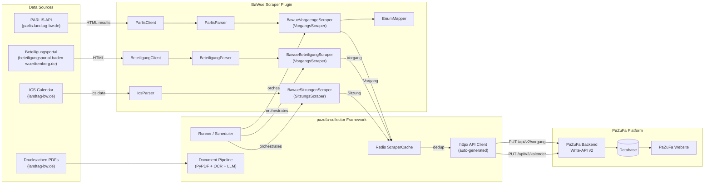
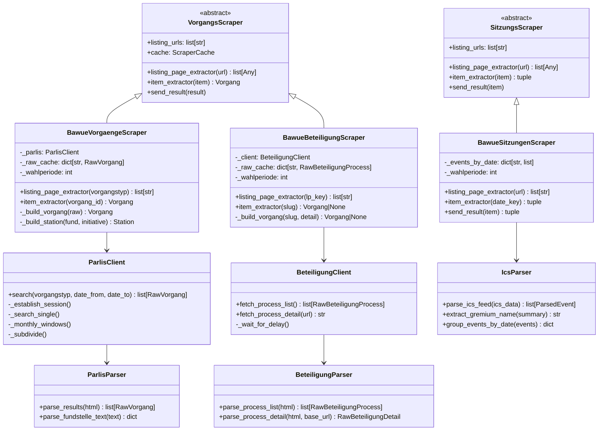
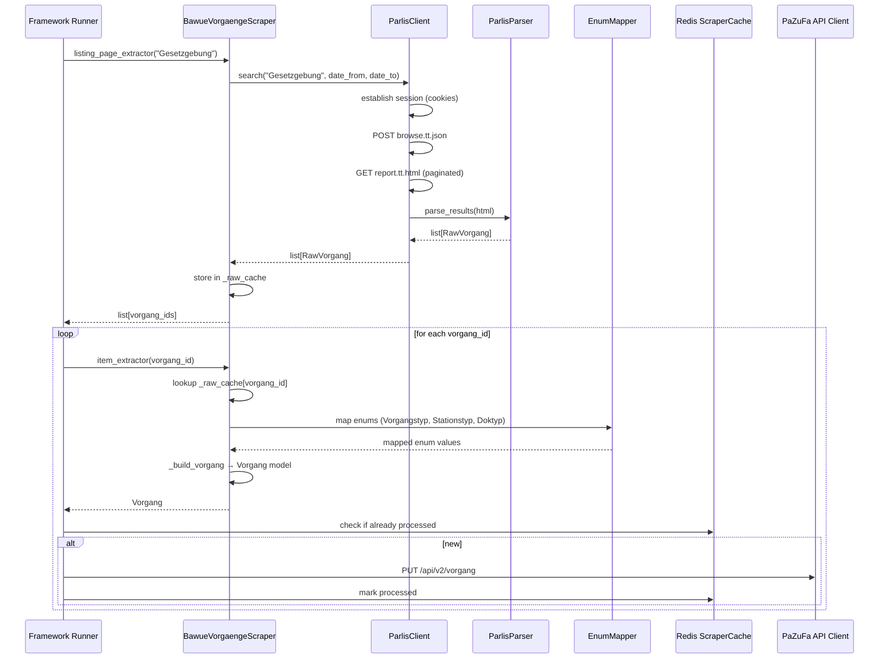

# Architecture: BaWue Scraper

## 1. System Overview

The BaWue Scraper is a **scraper plugin** for the
[pazufa-collector](https://codeberg.org/PaZuFa/pazufa-collector) framework within the Parlamentszusammenfasser (PaZuFa)
ecosystem. It implements `VorgangsScraper` and `SitzungsScraper` base classes, which the framework auto-discovers
and orchestrates. The framework handles all cross-cutting concerns — scheduling, Redis caching, API submission, document
processing, LLM summarization, and error tolerance.

The BaWue scraper covers three data sources:
1. **PARLIS** — parliamentary proceedings (Vorgänge) via HTML scraping
2. **Beteiligungsportal Baden-Württemberg** — pre-parliamentary draft laws (`preparl-regent` station) from public consultation
3. **ICS calendar** — parliamentary sessions (Sitzungen)



**Key characteristics:**
- Parliament code: `BW`
- Current Wahlperiode: 17
- Framework: pazufa-collector with auto-discovery
- Authentication: `X-API-Key` header with `collector` scope (handled by framework)
- Caching: Redis-based ScraperCache with 2-week TTL (handled by framework)
- Models: Auto-generated from OpenAPI specification (no hand-written models)
- The PaZuFa backend handles deduplication/merging — the scraper does not need to

## 2. Technology Choice

**Language: Python 3.12+** — matches the pazufa-collector framework.

| Dependency       | Purpose                                              | Owned by         |
|------------------|------------------------------------------------------|------------------|
| `requests`       | PARLIS + Beteiligungsportal HTTP sessions (synchronous) | BaWue scraper    |
| `lxml`           | HTML parsing of PARLIS and Beteiligungsportal pages  | BaWue scraper    |
| `icalendar`      | ICS calendar feed parsing for Sitzungen              | BaWue scraper    |
| `aiohttp`        | Async HTTP sessions for framework                    | Framework        |
| `httpx`          | Auto-generated PaZuFa API client                     | Framework        |
| `openapi-client` | Auto-generated Pydantic models from OpenAPI spec     | Framework        |
| `redis`          | Caching of processed Vorgänge/Dokumente              | Framework        |
| `litellm`        | LLM integration for document summarization           | Framework        |

**Build & packaging:** Poetry with `pyproject.toml`. Dependencies on `collector` and `openapi-client` as local path
dependencies.

## 3. Framework Integration

The scraper integrates with the pazufa-collector framework through the `VorgangsScraper` and `SitzungsScraper` base
classes:



### Auto-Discovery

The framework scans the configured `scraper-dir` for Python files matching `*_scraper.py` and loads classes that inherit
from `VorgangsScraper` or `SitzungsScraper`. The files `bawue_vorgaenge_scraper.py`, `bawue_beteiligung_scraper.py`, and
`bawue_sitzungen_scraper.py` are automatically discovered.

### VorgangsScraper Contract

| Method                     | Purpose                                             | BaWue implementation                                    |
|----------------------------|-----------------------------------------------------|---------------------------------------------------------|
| `listing_page_extractor()` | Fetch a listing page and return item identifiers    | Searches PARLIS by Vorgangstyp, returns vorgang IDs     |
| `item_extractor()`         | Convert a single item into a `Vorgang` model        | Looks up raw data from cache, builds framework `Vorgang` |
| `send_result()`            | Submit the result (inherited, not overridden)        | Framework handles API submission automatically          |

### SitzungsScraper Contract

| Method                     | Purpose                                                 | BaWue implementation                                         |
|----------------------------|---------------------------------------------------------|--------------------------------------------------------------|
| `listing_page_extractor()` | Fetch a listing source and return item identifiers      | Fetches ICS feed, parses events, returns ISO date strings    |
| `item_extractor()`         | Convert a single item into `(datetime, List[Sitzung])`  | Builds Sitzung models from cached ParsedEvents               |
| `send_result()`            | Submit the result                                       | **Overridden** to use `Parlament.BW` (base hardcodes `BY`)  |

### VorgangsScraper Contract (Beteiligungsportal)

| Method                     | Purpose                                             | Beteiligung implementation                                     |
|----------------------------|-----------------------------------------------------|----------------------------------------------------------------|
| `listing_page_extractor()` | Fetch a listing page and return item identifiers    | Fetches LP index, returns process slugs                        |
| `item_extractor()`         | Convert a single item into a `Vorgang` model        | Fetches detail page, builds `Vorgang` with `preparl-regent`   |
| `send_result()`            | Submit the result (inherited, not overridden)        | Framework handles API submission automatically                 |

### Listing URL Pattern

PARLIS does not have traditional listing URLs. Instead, `listing_urls` contains the 32 PARLIS Vorgangstyp strings
(e.g. `"Gesetzgebung"`, `"Kleine Anfrage"`). The framework calls `listing_page_extractor()` for each one.
`listing_page_extractor()` searches PARLIS, stores raw results in an internal `_raw_cache` dict, and returns a list
of vorgang IDs. The framework then calls `item_extractor()` for each ID, which builds the `Vorgang` model from the
cached raw data.

### Framework-Provided Capabilities

| Capability            | What the framework does                                             | Replaces from old project          |
|-----------------------|---------------------------------------------------------------------|------------------------------------|
| Scheduling            | Repeats scraping cycles at configurable intervals                   | `__main__.py` CLI loop             |
| Redis caching         | 2-week TTL, multi-level (vorgang, dokument, HTML)                   | File-based CacheManager            |
| API client            | Auto-generated httpx client with retry logic                        | Hand-written LtzfClient            |
| Models                | Auto-generated Pydantic models from OpenAPI spec                    | Hand-written domain models         |
| Document processing   | PyPDF + Kreuzberg/EasyOCR + LLM pipeline                           | pdfplumber + pytesseract           |
| Error tolerance       | Per-item error handling, doesn't stop on single failures            | Custom try/except in Orchestrator  |
| Config                | 4-tier: Defaults → TOML → env vars → CLI                           | pydantic-settings from env/.env    |

## 4. Data Flow



## 5. Component Breakdown

### 5.1 BawueVorgaengeScraper

The main scraper class. Subclass of `VorgangsScraper`.

**Responsibilities:**
- Load BaWue-specific configuration from `[bawue]` section of config.toml
- Implement `listing_page_extractor()`: search PARLIS for each Vorgangstyp
- Implement `item_extractor()`: convert raw PARLIS data into framework `Vorgang` models
- Maintain `_raw_cache` to bridge listing/item extraction phases

### 5.2 BawueSitzungenScraper

The Sitzungen scraper. Subclass of `SitzungsScraper`.

**Responsibilities:**
- Load BaWue-specific configuration from `[bawue]` section (reuses `_load_bawue_config` pattern)
- Implement `listing_page_extractor()`: fetch ICS calendar feed, parse and filter events, return ISO date strings
- Implement `item_extractor()`: build `Sitzung` models from cached `ParsedEvent` objects
- Override `send_result()`: use `Parlament.BW` instead of hardcoded `Parlament.BY`
- Maintain `_events_by_date` dict to bridge listing/item extraction phases

**Field mapping (Phase 1):**

| Sitzung field | Source         | Notes                                        |
|---------------|----------------|----------------------------------------------|
| `termin`      | DTSTART        | Naive → Europe/Berlin → UTC                  |
| `gremium`     | SUMMARY        | Parsed via `extract_gremium_name()`          |
| `nummer`      | —              | `0` (not available in ICS, Phase 2 enriches) |
| `tops`        | —              | `[]` (not available in ICS, Phase 2 enriches)|
| `public`      | —              | `True`                                       |
| `titel`       | SUMMARY        | Raw ICS SUMMARY value                        |
| `api_id`      | UID            | `uuid5(NAMESPACE_URL, uid)` for determinism  |

### 5.3 BawueBeteiligungScraper

The Beteiligungsportal scraper. Subclass of `VorgangsScraper`, auto-discovered as `bawue_beteiligung_scraper.py`.

**Responsibilities:**
- Load Beteiligungsportal-specific configuration from `[beteiligung]` section of config.toml
- Implement `listing_page_extractor()`: fetch LP index page, parse process cards, return slugs
- Implement `item_extractor()`: fetch detail page, parse metadata + PDFs, build `Vorgang` with `preparl-regent` station
- Filter non-legislative content (pages without Entwurf PDFs return `None`)
- Maintain `_raw_cache` to bridge listing/item extraction phases

**Data source:** [Beteiligungsportal Baden-Württemberg](https://beteiligungsportal.baden-wuerttemberg.de) — a TYPO3-based site where the state government publishes draft laws for public consultation before parliamentary introduction.

**Vorgang construction:**

| Vorgang field    | Source                                          |
|------------------|-------------------------------------------------|
| `api_id`         | `uuid5(NAMESPACE_URL, "beteiligung-{slug}")`    |
| `titel`          | Detail page heading (dossier-header h1)         |
| `kurztitel`      | URL slug (for backend merging with PARLIS data) |
| `typ`            | `Vorgangstyp.GG_MINUS_LAND_MINUS_PARL`         |
| `initiatoren`    | `[Autor(organisation=ministry)]`                |
| `ids`            | `[VgIdent(beteiligung_url)]`                    |

**Station mapping:**

| Station field | Value                             |
|---------------|-----------------------------------|
| `typ`         | `Stationstyp.PREPARL_MINUS_REGENT`|
| `gremium`     | `Parlament.BW, "Landesregierung"` |
| `dokumente`   | Each PDF → `Doktyp.PREPARL_MINUS_ENTWURF` |
| `zp_start`    | Comment deadline date             |

### 5.4 BeteiligungClient

Encapsulates HTTP communication with the Beteiligungsportal using synchronous `requests.Session`.

**Responsibilities:**
- Fetch LP index page (`/de/mitmachen/lp-{wp}`) and parse into process list
- Fetch individual process detail pages
- Respectful request delays between calls (configurable, default 2.0s)
- User-Agent: `PaZuFa-BaWue-Scraper/0.1`

### 5.5 BeteiligungParser

Stateless functions for parsing Beteiligungsportal HTML (TYPO3 structure) using lxml/XPath.

**Responsibilities:**
- Parse LP index page: extract process cards (`article.teaser`) with title, URL, status (open/closed from badge text)
- Parse detail page: extract title (dossier-header h1), ministry (contact-box), PDF links (`a.link-download-block`), comment deadline, phase timeline
- Strip soft hyphens (`\xad`) from titles
- Resolve relative PDF URLs to absolute URLs

**Data classes:**
- `RawBeteiligungProcess` — title, url, slug, status
- `RawBeteiligungDetail` — title, ministry, pdf_links, comment_deadline, phases

### 5.6 IcsParser

Stateless functions for parsing ICS calendar feeds.

**Responsibilities:**
- Parse ICS bytes via the `icalendar` library
- Filter events by SUMMARY prefix (include plenary, committee, Haushaltsberatungen; exclude factions, presidium, elections)
- Extract gremium names from SUMMARY strings
- Group parsed events by calendar date

**Event filtering rules:**

| SUMMARY prefix                                  | Included? | Gremium name            |
|-------------------------------------------------|-----------|-------------------------|
| `Plenarsitzung:`                                | Yes       | `"Plenum"`              |
| `Fraktions- und Ausschusssitzungen: Ausschuesse`| Yes       | `"Ausschusssitzungen"` |
| `Fraktions- und Ausschusssitzungen: FinA`       | Yes       | `"Finanzausschuss"`     |
| `Haushaltsberatungen: ...`                      | Yes       | extract after `: `      |
| `Fraktions- und Ausschusssitzungen: Fraktionen` | No        | faction-only            |
| `Prasidium:`                                    | No        | internal                |
| `Wahl:`                                         | No        | election event          |

### 5.7 ParlisClient

Encapsulates all PARLIS HTTP communication using synchronous `requests.Session`.

**Responsibilities:**
- Session management (load start page, extract cookies)
- Construct search queries (Vorgangstyp, Wahlperiode, date range)
- Execute search via `POST browse.tt.json`
- Fetch paginated results via `GET report.tt.html`
- Automatic date subdivision when result sets are too large (monthly windows)
- Respectful request delays between PARLIS calls

### 5.8 ParlisParser

Stateless functions for parsing PARLIS HTML responses.

**Responsibilities:**
- Parse HTML records (XPath: `.//div[contains(@class, "efxRecordRepeater")]`)
- Extract Vorgang fields (title, ID, Vorgangstyp, initiative)
- Parse Fundstellen text into structured data (station type, date, Drucksache, committee, PDF URL)
- Parse HTML comment blocks for additional raw field data

### 5.9 EnumMapper

Maps PARLIS terminology to PaZuFa enum values from the auto-generated OpenAPI models.

**Responsibilities:**
- Map 32 Vorgangstyp strings to `Vorgangstyp` enum
- Map Fundstelle station types to `Stationstyp` enum (context-dependent, e.g. Gesetzentwurf from
  Landesregierung → `preparl-regent`)
- Map document references to `Doktyp` enum
- Fall back to `SONSTIG` for unmapped values

### 5.10 AdaptiveRateLimiter (rate_limiter.py)

Provides AIMD-inspired adaptive request pacing for ParlisClient and BeteiligungClient.

- **Success:** delay shrinks 10% toward minimum
- **HTTP 429:** pause 30× current delay, then resume at 50% of current delay
- **wait():** sleeps only the remaining time since the last request (no double-waiting)

### 5.11 Types

TypedDict definitions for internal data exchange between ParlisClient, ParlisParser, and BawueVorgaengeScraper.

- `RawFundstelle` — parsed Fundstelle with station_typ, datum, drucksache, plenarprotokoll, ausschuss, autor_text, pdf_url
- `RawVorgang` — parsed Vorgang with titel, vorgangs_id, Vorgangstyp, Initiative, fundstellen_parsed

## 6. PARLIS Scraping Strategy

### 6.1 Session Management

PARLIS requires an active session (cookies) before API calls succeed.

1. `GET https://parlis.landtag-bw.de/parlis/` — obtain session cookies
2. Store cookies in `requests.Session` for subsequent calls
3. Set `Referer: https://parlis.landtag-bw.de/parlis/` on all requests
4. Sessions expire — re-establish before each search cycle

### 6.2 Search Query Construction

```json
{
    "action": "SearchAndDisplay",
    "report": {
        "rhl": "main",
        "rhlmode": "add",
        "format": "suchergebnis-vorgang-full",
        "mime": "html",
        "sort": "SORT01/D SORT02/D SORT03"
    },
    "search": {
        "lines": {
            "l1": "<wahlperiode>",
            "l2": "<start_date DD.MM.YYYY>",
            "l3": "<end_date DD.MM.YYYY>",
            "l4": "<vorgangstyp>"
        },
        "serverrecordname": "vorgang"
    },
    "sources": ["Star"]
}
```

**Constraints discovered during testing:**
- Only `serverrecordname: "vorgang"` works — other values hang indefinitely
- Only `format: "suchergebnis-vorgang-full"` returns usable results
- Unfiltered searches (no Vorgangstyp) also hang — always filter by type

### 6.3 Pagination

1. `POST browse.tt.json` returns `{ report_id, item_count }`
2. Fetch pages: `GET report.tt.html?report_id=X&start=N&chunksize=50`
3. Increment `start` by `chunksize` until `start >= item_count`

### 6.4 Fundstellen Parsing

Each Vorgang record contains Fundstellen (references) that encode station data as semi-structured text:

```
"Gesetzentwurf    Fraktion GRÜNE, Fraktion der CDU  04.02.2026 Drucksache 17/10266   (13 S.)"
"Erste Beratung   Plenarprotokoll 17/141 05.02.2026"
"Beschlussempfehlung und Bericht    Ausschuss für Wirtschaft  02.02.2026 Drucksache 17/10210"
```

Extractable fields via regex: station type, date, Drucksache number, Plenarprotokoll reference, committee name,
page count, PDF URL, author text (gap between station type and date).

### 6.5 Incremental Date Filtering

Large Vorgangstypen (e.g. "Kleine Anfrage" with 4000+ hits) cause the API to return `status: "running"` without a
`report_id`. 5-step strategy:

1. Try full search for a Vorgangstyp
2. If no `report_id` (status=running) → subdivide into monthly windows
3. For each monthly window, try search
4. If monthly window still too large → `_subdivide()` recursively halves it (binary search)
5. If single-day window still too large → skip with warning

## 7. Enum Mapping

### Vorgangstyp → PaZuFa `typ`

| PARLIS Vorgangstyp                        | PaZuFa `typ`   |
|-------------------------------------------|----------------|
| Gesetzgebung                              | `gg-land-parl` |
| Haushaltsgesetzgebung                     | `gg-land-parl` |
| Volksantrag                               | `gg-land-parl` |
| Antrag                                    | `sonstig`      |
| Kleine Anfrage                            | `sonstig`      |
| Große Anfrage                             | `sonstig`      |
| Mündliche Anfrage                         | `sonstig`      |
| Aktuelle Debatte                          | `sonstig`      |
| Regierungserklärung/Regierungsinformation | `sonstig`      |
| Untersuchungsausschuss                    | `sonstig`      |
| *(all others — 32 types total)*           | `sonstig`      |

### Fundstelle station type → PaZuFa `Stationstyp`

| Fundstelle text pattern                          | PaZuFa `Stationstyp` |
|--------------------------------------------------|----------------------|
| Gesetzentwurf (from Landesregierung)             | `preparl-regent`     |
| Gesetzentwurf (from Fraktion/Abgeordnete)        | `parl-initiativ`     |
| Antrag                                           | `parl-initiativ`     |
| Erste Beratung, Zweite Beratung, Dritte Beratung | `parl-vollvlsgn`     |
| Beschlussempfehlung und Bericht                  | `parl-ausschber`     |
| Ausschussberatung                                | `parl-ausschber`     |
| Zustimmung, Annahme                              | `parl-akzeptanz`     |
| Ablehnung                                        | `parl-ablehnung`     |
| Ausfertigung                                     | `postparl-vesja`     |
| Gesetzblatt                                      | `postparl-gsblt`     |
| Inkrafttreten                                    | `postparl-kraft`     |
| *(unrecognized)*                                 | `sonstig`            |

### Dokumententyp mapping

| Document context                      | PaZuFa `Doktyp`  |
|---------------------------------------|-------------------|
| Gesetzentwurf (vorparlamentarisch)    | `preparl-entwurf` |
| Gesetzentwurf (parlamentarisch)       | `entwurf`         |
| Antrag                                | `antrag`          |
| Kleine/Große/Mündliche Anfrage        | `anfrage`         |
| Antwort (Stellungnahme der Regierung) | `antwort`         |
| Beschlussempfehlung                   | `beschlussempf`   |
| Stellungnahme                         | `stellungnahme`   |
| Plenarprotokoll                       | `redeprotokoll`   |
| Mitteilung                            | `mitteilung`      |
| *(unrecognized)*                      | `sonstig`         |

## 8. Error Handling

Error handling is primarily managed by the pazufa-collector framework:

| Concern                | Handled by      | Behavior                                                    |
|------------------------|-----------------|-------------------------------------------------------------|
| Per-item failures      | Framework       | Logs error, continues with next Vorgang                     |
| API submission retries | Framework       | Automatic retry with backoff                                |
| Cache failures         | Framework       | Graceful degradation (continues without caching)            |
| PARLIS session expiry  | ParlisClient    | Re-establishes session before each search cycle             |
| Large result sets      | ParlisClient    | Automatic date subdivision into monthly windows             |
| PARLIS HTTP errors     | ParlisClient    | `raise_for_status()`, propagated to framework error handler |
| Beteiligungsportal HTTP errors | BeteiligungClient | `raise_for_status()`, propagated to framework error handler |
| Beteiligungsportal HTML changes | BeteiligungParser | Unit tests with HTML fixtures detect regressions            |

## 9. Deployment

### Docker Container

```
Dockerfile
├── Base: python:3.12-slim
├── System deps: tesseract-ocr, tesseract-ocr-deu, poppler-utils
├── Python deps: via poetry install
├── Vendor: pazufa-collector (copied into build context)
└── Entrypoint: python -m collector --config-file config.toml
```

The Docker build expects `vendor/pazufa-collector/` in the build context:

```bash
mkdir -p vendor
cp -r ../pazufa-collector vendor/pazufa-collector
docker build -t bawue-scraper .
```

### Infrastructure

| Component     | Purpose                             | Required |
|---------------|-------------------------------------|----------|
| Docker        | Container runtime                   | Yes      |
| Redis         | Caching (ScraperCache)              | Optional |
| PaZuFa Backend| API target for data submission      | Yes      |

Redis is optional — the framework degrades gracefully without it (no caching, all items reprocessed each cycle).

### Configuration

All configuration is via `config.toml` with environment variable overrides:

| config.toml key           | Env variable override    | Description                              |
|---------------------------|--------------------------|------------------------------------------|
| `[backend] ltzf-api-key`  | `LTZF_API_KEY`           | API key (scope: collector)               |
| `[backend] ltzf-api-url`  | `LTZF_API_URL`           | PaZuFa backend URL                       |
| `[main] collector-uuid`   | `COLLECTOR_ID`           | Unique collector instance ID             |
| `[cache] redis-host`      | `REDIS_HOST`             | Redis host                               |
| `[llm] provider-key`      | `LLM_PROVIDER_KEY`       | LLM API key                              |
| `[llm] model`             | `LLM_MODEL`              | LLM model (default: gpt-5-nano)          |

## 10. Risks & Mitigation

| Risk                                  | Impact                                       | Mitigation                                                                          |
|---------------------------------------|----------------------------------------------|-------------------------------------------------------------------------------------|
| **PARLIS API changes**                | Scraper breaks entirely                      | Comprehensive error logging, health-check alerts, quick-fix turnaround              |
| **PARLIS session instability**        | Intermittent failures                        | Session re-establishment before each search cycle                                   |
| **Large result sets**                 | API returns `status: "running"` without data | Automatic monthly window subdivision in ParlisClient                                |
| **Enum ambiguity**                    | Incorrect mapping of PARLIS types            | Conservative mapping — `sonstig` as fallback, all unmapped values logged            |
| **Rate limiting by Landtag**          | IP blocked                                   | Configurable delays, descriptive User-Agent                                         |
| **Fundstelle text format changes**    | Station parsing breaks                       | Regex-based parsing with fallback, unit tests with known samples                    |
| **verfassungsaendernd not available** | Required field cannot be determined          | Default to `false` (PARLIS does not expose this field)                              |
| **Sync/async coexistence**            | PARLIS uses sync requests in async framework | `asyncio.to_thread()` wraps sync calls in both vorgaenge and beteiligung scrapers    |

## 11. Migration from Standalone Scraper

This project was migrated from a standalone hexagonal-architecture scraper
(`landtagszusammenfasser_bawue_scraper`) to the pazufa-collector framework. Key changes:

| Aspect              | Before (standalone)                     | After (framework plugin)                     |
|---------------------|-----------------------------------------|----------------------------------------------|
| Architecture        | Hexagonal (ports & adapters)            | Framework plugin (VorgangsScraper subclass)   |
| Models              | Hand-written Pydantic models            | Auto-generated from OpenAPI spec              |
| Enums               | Hand-written StrEnum classes            | Auto-generated (MINUS naming: `GG_MINUS_LAND_MINUS_PARL`) |
| API client          | Hand-written LtzfClient                 | Auto-generated httpx client                   |
| Caching             | File-based JSON cache                   | Redis ScraperCache (2-week TTL)               |
| PDF extraction      | pdfplumber + pytesseract                | Framework pipeline (PyPDF + Kreuzberg + LLM)  |
| Configuration       | pydantic-settings (.env)                | 4-tier (Defaults → TOML → env → CLI)          |
| Orchestration       | Custom Orchestrator class               | Framework runner with auto-discovery           |
| ICS calendar        | IcsAdapter (not implemented)            | BawueSitzungenScraper (Phase 1 complete)       |
| Deployment          | Standalone Docker / AWS Lambda          | Framework-managed Docker container             |

Components preserved as PARLIS-specific logic:
- `ParlisClient` — session management, search, pagination, date subdivision
- `ParlisParser` — HTML parsing, fundstelle regex extraction
- `EnumMapper` — PARLIS terminology → PaZuFa enum mapping
- `RawVorgang` / `RawFundstelle` TypedDicts — internal intermediary data structures

## 12. Future Work

| Feature                       | Priority  | Description                                                                     |
|-------------------------------|-----------|---------------------------------------------------------------------------------|
| ~~**SitzungsScraper Ph.1**~~  | Erledigt  | ICS calendar parsing, Sitzung models with `nummer=0`, `tops=[]`                 |
| **SitzungsScraper Phase 2**   | Hoch      | Enrich with Tagesordnungen PDFs: session numbers from filenames, TOPs from PDFs |
| ~~**Beteiligungsportal**~~    | Erledigt  | `BawueBeteiligungScraper` — preparl-regent station with Entwurf PDFs            |
| **Kabinettsberichte (STM)**   | Optional  | Signalquelle für neue Regierungsentwürfe                                        |
| **Gesetzblatt BaWue**         | Ergänzend | Verkündungen (`postparl-gsblt` station)                                         |
| **PARLIS Detail-Seiten**      | Ergänzend | Additional data from individual Vorgang detail pages                            |
| ~~**asyncio.to_thread()**~~   | Erledigt  | Already used in both vorgaenge and beteiligung scrapers for sync-in-async calls |
| ~~**Dokument-Autoren**~~      | Erledigt  | Autoren aus Fundstelle-Text extrahiert, Fallback auf Initiative                 |
